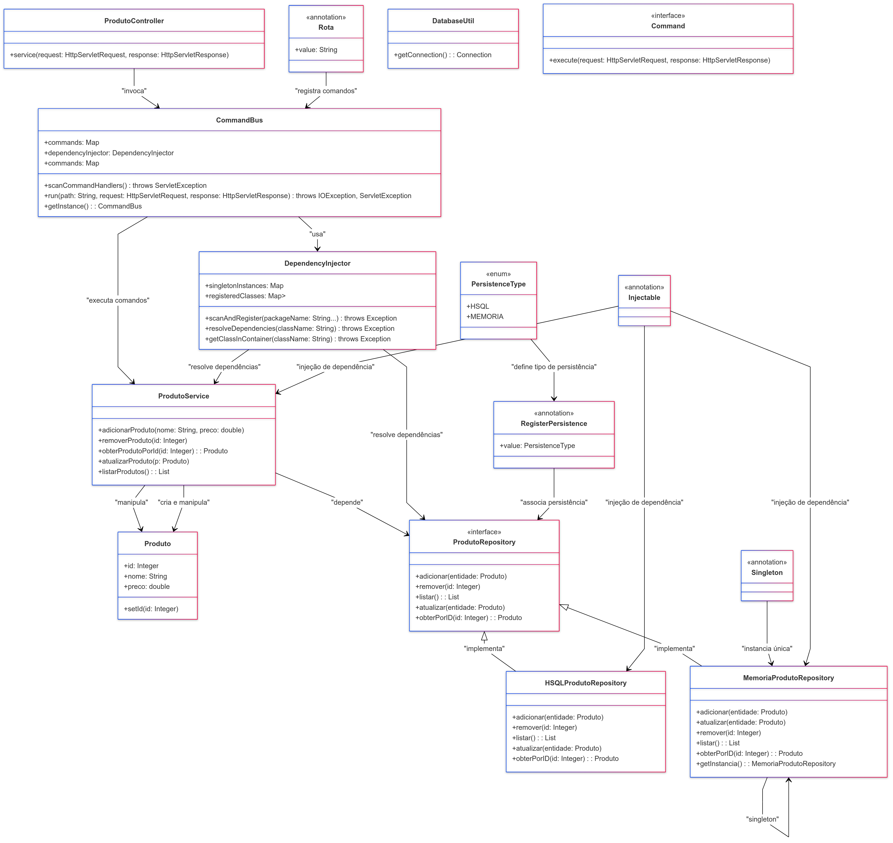
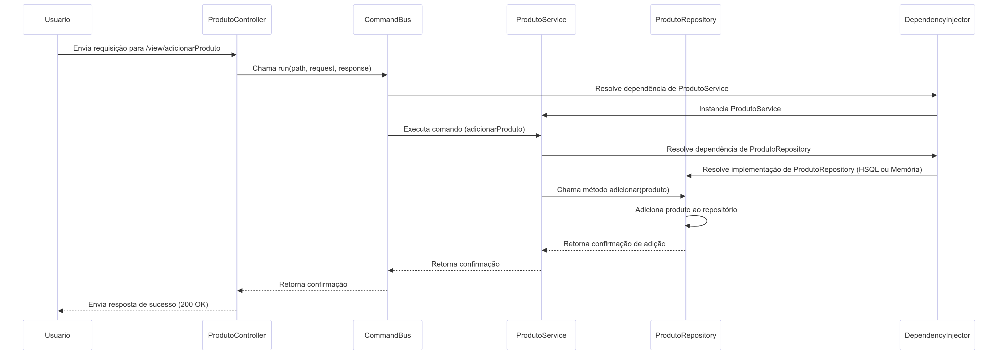

# Sistema de Injeção de Dependências e Gerenciamento de Rotas

---

## **Integrantes*
- Alisson de Oliveira - R.A **200029600**
- Davi Ribeiro - R.A **200016718**
- Denilson Melo - R.A **200028969**
- Maria Clara Mendes - R.A **200028802**
- Maria Fernanda Barçante - R.A **200028863**
- Vinicius Lago - R.A **200028769**
- Adnan Fatal Anunciação Nascimento - R.A **200028791**
- Larissa da Silva Santana - R.A **200029897**
- Luan Gabriel Ornelas Sacramento Oliveira - R.A  **20027297**

## **Descrição Geral**
Este projeto é um **sistema de injeção de dependências** que utiliza reflexão para gerenciar a criação de instâncias de forma automática, suportando anotações personalizadas e organização de dependências. Além disso, implementa um **sistema de gerenciamento de rotas** baseado no padrão **Command**, permitindo que rotas sejam registradas e executadas dinamicamente.

 - Projeto está dentro da porta [http://localhost:4000/prova2/view/](http://localhost:4000/prova2/view/)
---

## **Explicação das Anotações Criadas**

### **`@Injectable`**
- **Propósito**: Indica que a classe é elegível para injeção de dependências.
- **Funcionamento**:
    - Detectada automaticamente durante a varredura de pacotes.
    - Registrada no contêiner IoC.
    - Deve possuir um construtor público ou anotado com `@Inject`.

---

### **`@Inject`**
- **Propósito**: Marca o construtor que será usado para injetar dependências.
- **Funcionamento**:
    - Se presente, o sistema utiliza este construtor para criar instâncias da classe.
    - Caso ausente, o construtor padrão será utilizado.

---

### **`@Singleton`**
- **Propósito**: Garante que a classe tenha apenas uma instância durante todo o ciclo de vida do sistema.
- **Funcionamento**:
    - Classes anotadas com `@Singleton` têm suas instâncias armazenadas no mapa `singletonInstances` e reutilizadas em chamadas subsequentes.

---

### **`@RegisterPersistence`**
- **Propósito**: Configura o tipo de persistência que será utilizado.
- **Funcionamento**:
    - Associa um `enum PersistenceType` à classe que retorna o nome da classe dentro do contexto de persistência.
    - Utilizado pelo sistema para criar implementações de repositórios dinamicamente.

```java
package br.com.ucsal.persistencia;

public enum PersistenceType {
    MEMORIA("MemoriaProdutoRepository"),
    HSQL("HSQLProdutoRepository");

    private final String className;

    PersistenceType(String className) {
        this.className = className;
    }

    public String getClassName() {
        return className;
    }
}


```

---

### **`@Rota`**
- **Propósito**: Define o mapeamento de rotas para comandos no padrão **Command**.
- **Funcionamento**:
    - Especifica o valor da rota (caminho) que será associada a um comando.
    - Classes anotadas são registradas no sistema de rotas.

---

## **Gerenciamento de Rotas com CommandBus**

A classe `CommandBus` é responsável por escanear, registrar e executar comandos baseados no padrão **Command**, integrando-se ao sistema de injeção de dependências para criar instâncias dinamicamente.

### **Funcionamento do CommandBus**

1. **Varredura de Rotas**:
    - O método `scanCommandHandlers` utiliza reflexão para identificar todas as classes anotadas com `@Rota`.
    - As rotas encontradas são registradas no mapa `commands`, associando o caminho da rota ao comando correspondente.

2. **Criação de Instâncias**:
    - O método `createCommandInstance` utiliza o `DependencyInjector` para criar instâncias dos comandos.
    - Isso garante que todas as dependências do comando sejam resolvidas automaticamente.

3. **Execução de Comandos**:
    - O método `run` localiza o comando associado à rota solicitada e o executa.
    - Se nenhuma rota correspondente for encontrada, retorna um erro HTTP 404.

---

### **Integração com o Sistema de Injeção de Dependências**

O `CommandBus` utiliza o **DependencyInjector** para gerenciar a criação de instâncias de comandos. Isso permite que cada comando tenha suas dependências injetadas automaticamente.

#### **Benefícios**:
- **Flexibilidade**: Adicionar ou modificar comandos é simples, bastando anotar as classes com `@Rota`.
- **Reuso**: Comandos podem reutilizar dependências resolvidas pelo `DependencyInjector`.
- **Escalabilidade**: Permite gerenciar um grande número de rotas sem alterar o código principal.

---

## **Uso de Reflexão para Carga Dinâmica**

### **No DependencyInjector**
- Identifica classes anotadas com `@Injectable` ou `@RegisterPersistence`.
- Registra essas classes no contêiner IoC e resolve dependências recursivamente.

### **No CommandBus**
- Detecta classes anotadas com `@Rota`.
- Cria instâncias dinâmicas dos comandos, registrando-as com base na rota associada.

---

## **Troca de Repositórios com Factory Method**

O projeto utiliza o padrão **Factory Method** para alternar entre diferentes implementações de repositórios com base no tipo de persistência configurado.

### **Funcionamento**
1. **Configuração**:
    - A anotação `@RegisterPersistence` define o tipo de persistência (ex.: banco de dados ou arquivo).
    - O tipo configurado é armazenado na variável `persistenceType`.

2. **Resolução de Dependências**:
    - Durante a criação de instâncias, o sistema identifica repositórios e utiliza o tipo configurado para instanciar a implementação correta.

#### **Vantagens**:
- A troca de implementações é transparente para o restante do sistema.
- Segue o princípio **Open/Closed** do SOLID.

---

## **Padrão Singleton**

O padrão **Singleton** é implementado para garantir que certas classes tenham apenas uma instância no ciclo de vida do sistema.

### **Funcionamento**
1. **Detecção de Singleton**:
    - Durante a criação de instâncias, o sistema verifica se a classe está anotada com `@Singleton`.

2. **Reuso de Instâncias**:
    - Classes anotadas com `@Singleton` são armazenadas no mapa `singletonInstances` e reutilizadas.

#### **Vantagens**:
- Redução de consumo de recursos.
- Consistência no estado de instâncias compartilhadas.

---

## **Fluxo Geral do Sistema**

1. **Escaneamento e Registro**:
    - O `DependencyInjector` escaneia pacotes, registra classes anotadas, e resolve dependências dinamicamente.
    - O `CommandBus` escaneia classes anotadas com `@Rota` e registra as rotas.

2. **Execução de Comandos**:
    - Quando uma rota é solicitada, o `CommandBus` localiza o comando associado e o executa.
    - Dependências do comando são injetadas automaticamente pelo `DependencyInjector`.

3. **Troca de Repositórios**:
    - Repositórios são resolvidos dinamicamente com base no tipo de persistência configurado.

---


## Diagrama de Classe



## Diagrama de Sequência


## **Conclusão**

Este projeto automatiza a injeção de dependências e o gerenciamento de rotas, integrando padrões como **IoC**, **Factory Method**, **Singleton** e **Command**. Ele facilita o desenvolvimento, a escalabilidade e a manutenção do código, promovendo boas práticas de programação como:
- **Responsabilidade Única**: Cada componente tem uma função clara.
- **Open/Closed**: Novos comandos e implementações de repositórios podem ser adicionados sem alterar o sistema existente.
- **Reuso**: Instâncias e dependências são gerenciadas de forma eficiente e reutilizadas sempre que possível.
